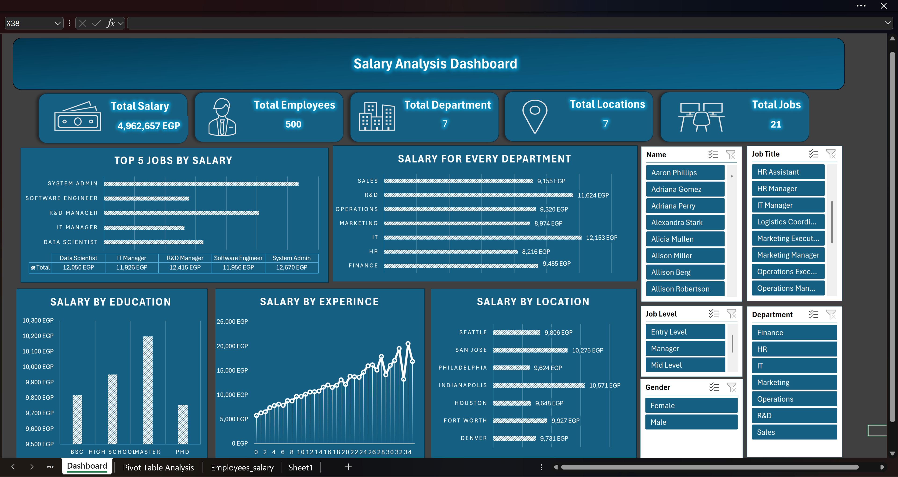

# 💼 Salary Analysis Dashboard

An interactive Excel dashboard analyzing employee salaries across departments, job titles, education levels, experience, and locations.

--------------------------------------------------------------------------------------------------

# 📌 Project Overview

This project focuses on exploring salary distribution and workforce insights using employee salary data.

The dashboard was designed to help answer important HR and business questions related to:
- Salary differences between departments
- High-paying job roles
- Impact of education and experience on salary
- Salary distribution across locations
- Workforce demographics and employee structure

--------------------------------------------------------------------------------------------------

# 🎯 Project Goals

- Analyze salary distribution across departments and job roles
- Identify top-paying positions
- Explore salary trends based on experience and education
- Compare salaries between locations
- Build an interactive HR dashboard for workforce analysis

--------------------------------------------------------------------------------------------------

# 🛠️ Tools Used

- Microsoft Excel
- Pivot Tables
- Pivot Charts
- Slicers
- Data Cleaning
- Dashboard Design

--------------------------------------------------------------------------------------------------

# 📂 Dashboard Features

## 📊 Executive Overview
Provides a high-level summary of employee and salary data.

### Includes:
- Total Salary
- Total Employees
- Total Departments
- Total Locations
- Total Job Titles

### Key Insight:
The organization contains a diverse workforce spread across multiple departments and locations.

--------------------------------------------------------------------------------------------------

## 💰 Salary by Job Title
Analyzes the highest-paying job positions.

### Includes:
- Top 5 jobs by salary
- Salary comparison between roles

### Key Insight:
Technical and management-related positions show the highest salary levels.

--------------------------------------------------------------------------------------------------

## 🏢 Salary by Department
Compares salary performance across departments.

### Includes:
- Department salary averages
- Department comparison analysis

### Key Insight:
IT and R&D departments have some of the highest salary averages in the organization.

--------------------------------------------------------------------------------------------------

## 🎓 Salary by Education
Explores how education level affects salary.

### Includes:
- Salary comparison by degree level
- Education impact analysis

### Key Insight:
Employees with advanced degrees generally receive higher salaries.

---

## 📈 Salary by Experience
Tracks salary growth with years of experience.

### Includes:
- Experience vs salary trend
- Salary progression analysis

### Key Insight:
Salary tends to increase consistently with experience, especially in senior-level positions.

---

## 🌍 Salary by Location
Analyzes salary distribution across locations.

### Includes:
- Location salary comparison
- Geographic salary trends

### Key Insight:
Some cities offer significantly higher salaries compared to others.

--------------------------------------------------------------------------------------------------

## 🎛️ Interactive Filters
Allows dynamic exploration of the data.

### Filters Include:
- Employee Name
- Job Title
- Job Level
- Department
- Gender

--------------------------------------------------------------------------------------------------

# 📷 Dashboard Preview

--------------------------------------------------------------------------------------------------

# 📊 Key Insights

- IT and R&D departments lead in salary averages
- Senior and technical roles receive higher compensation
- Experience positively impacts salary growth
- Education level influences salary distribution
- Salary differences exist across locations and departments

--------------------------------------------------------------------------------------------------

# 🚀 Skills Strengthened

Through this project, I improved my ability to:
- Build interactive Excel dashboards
- Work with Pivot Tables and Pivot Charts
- Create KPI-driven HR analysis
- Design clean and professional dashboards
- Analyze workforce and compensation data

--------------------------------------------------------------------------------------------------

By
Mohamed Ashraf  
Data Analyst | Excel & Power BI Enthusiast
